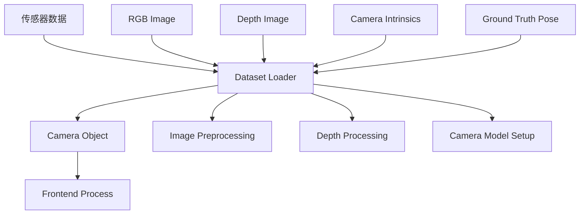
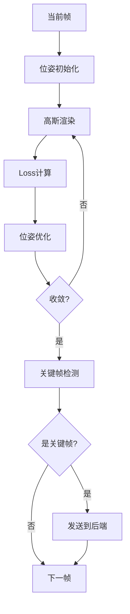
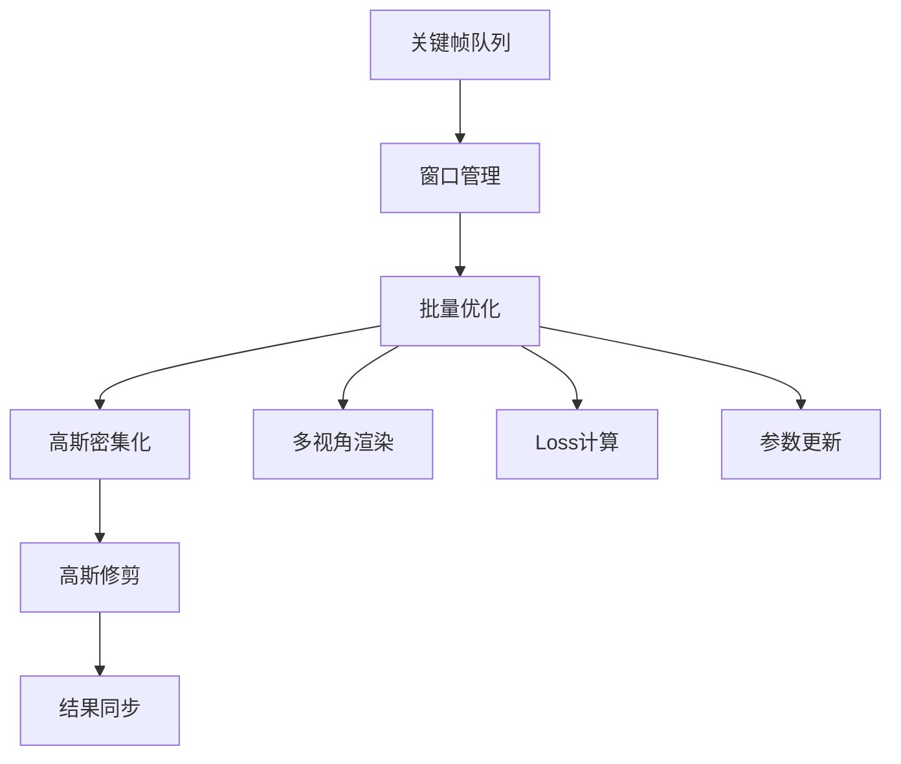
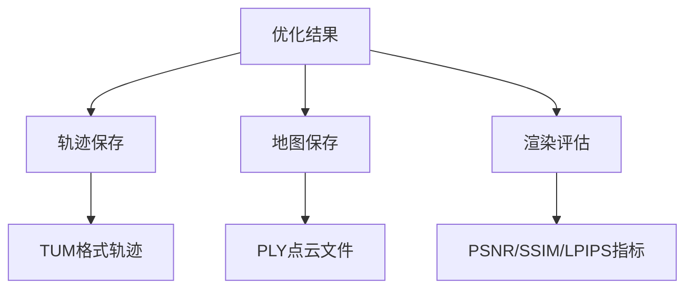

# MonoGS 架构设计与实现详解

## 1. 概述

MonoGS (Monocular Gaussian Splatting) 是一个基于3D高斯溅射技术的实时SLAM系统，支持单目、双目和RGB-D相机。该系统通过将经典SLAM前后端架构与3D高斯溅射相结合，实现了高质量的实时三维重建。

### 1.1 核心创新点

1. **3D高斯溅射作为场景表示**：替代传统的点云或体素网格
2. **前后端分离架构**：前端负责跟踪，后端负责建图和优化
3. **自适应关键帧管理**：基于重叠度和距离的智能关键帧选择
4. **多传感器支持**：统一框架支持单目、RGB-D和双目相机
5. **实时性能**：通过CUDA加速的高斯渲染实现实时运行

## 2. 整体架构

### 2.1 系统架构图

```
┌─────────────────────────────────────────────────────────────────┐
│                        MonoGS SLAM 系统                          │
├─────────────────┬─────────────────┬─────────────────┬───────────┤
│    数据输入      │    前端跟踪      │    后端建图      │    GUI    │
├─────────────────┼─────────────────┼─────────────────┼───────────┤
│ • RGB 图像      │ • 位姿跟踪      │ • 关键帧管理    │ • 实时显示│
│ • 深度图像      │ • 关键帧检测    │ • 高斯优化      │ • 参数调节│
│ • 相机内参      │ • 特征匹配      │ • BA优化        │ • 交互控制│
│ • 时间戳        │ • 运动估计      │ • 回环检测      │           │
└─────────────────┴─────────────────┴─────────────────┴───────────┘
                  │                 │
                  ▼                 ▼
            ┌──────────┐      ┌──────────┐
            │前端队列   │      │后端队列   │
            │Frontend  │◄────►│Backend   │
            │Queue     │      │Queue     │
            └──────────┘      └──────────┘
                  │                 │
                  ▼                 ▼
            ┌──────────┐      ┌──────────┐
            │位姿估计   │      │高斯建图   │
            │Tracking  │      │Mapping   │
            └──────────┘      └──────────┘
```

### 2.2 核心组件

#### 2.2.1 SLAM 主类 (slam.py:25-196)
- **功能**：系统总控制器，协调各组件工作
- **主要职责**：
  - 初始化所有子系统
  - 管理进程间通信
  - 控制系统生命周期
  - 性能评估和结果保存

#### 2.2.2 前端跟踪 (FrontEnd)
- **文件位置**：`utils/slam_frontend.py:18`
- **进程模式**：独立进程
- **主要功能**：
  - 相机位姿跟踪
  - 关键帧检测与管理
  - 与后端通信

#### 2.2.3 后端建图 (BackEnd)
- **文件位置**：`utils/slam_backend.py:16`
- **进程模式**：独立进程
- **主要功能**：
  - 高斯地图优化
  - Bundle Adjustment
  - 高斯密集化和修剪

#### 2.2.4 高斯模型 (GaussianModel)
- **文件位置**：`gaussian_splatting/scene/gaussian_model.py:34`
- **核心数据结构**：
  - 3D位置 (`_xyz`)
  - 球谐系数 (`_features_dc`, `_features_rest`)
  - 缩放参数 (`_scaling`)
  - 旋转参数 (`_rotation`)
  - 不透明度 (`_opacity`)

## 3. 数据流分析

### 3.1 输入数据流



**输入数据格式**：
- **RGB图像**：`torch.Tensor [3, H, W]`，范围 [0,1]
- **深度图像**：`torch.Tensor [1, H, W]`，单位：米
- **相机内参**：`fx, fy, cx, cy, k1, k2, p1, p2, k3`
- **位姿真值**：`4×4` 变换矩阵（用于评估）

### 3.2 前端数据流



**前端处理流程** (`utils/slam_frontend.py:300-500`)：

1. **位姿初始化**：
   ```python
   # 从上一帧位姿开始
   viewpoint.update_RT(self.cameras[cur_frame_idx-1].R, 
                      self.cameras[cur_frame_idx-1].T)
   ```

2. **跟踪优化** (`tracking` 函数)：
   - 渲染当前视角
   - 计算光度Loss和几何Loss
   - 使用梯度下降优化位姿参数

3. **关键帧检测** (`is_keyframe` 函数)：
   - 距离条件：`dist > kf_translation * median_depth`
   - 重叠度条件：`point_ratio < kf_overlap`

### 3.3 后端数据流



**后端处理流程** (`utils/slam_backend.py:130-280`)：

1. **窗口维护**：
   - 滑动窗口大小：默认8个关键帧
   - 基于视角重叠度移除远程关键帧

2. **Bundle Adjustment**：
   ```python
   # 同时优化相机位姿和高斯参数
   for viewpoint in current_window:
       render_pkg = render(viewpoint, gaussians, pipeline_params)
       loss += get_loss_mapping(image, depth, viewpoint, opacity)
   ```

3. **高斯管理**：
   - **密集化**：在梯度较大区域添加新高斯
   - **修剪**：移除不透明度低或观测次数少的高斯
   - **分裂**：大尺度高斯分裂成多个小高斯

### 3.4 输出数据流



**输出格式**：
- **相机轨迹**：TUM格式 (timestamp tx ty tz qx qy qz qw)
- **3D高斯地图**：PLY格式，包含位置、颜色、形状参数
- **渲染图像**：PNG格式，用于质量评估

## 4. 核心算法实现

### 4.1 前端跟踪算法

**位姿优化目标函数** (`utils/slam_utils.py:get_loss_tracking`):

```python
def get_loss_tracking(config, image, depth, opacity, viewpoint):
    # 光度误差
    l1_loss_rgb = l1_loss(image, gt_image)
    ssim_loss_rgb = 1.0 - ssim(image, gt_image)
    loss_rgb = (1.0 - lambda_dssim) * l1_loss_rgb + lambda_dssim * ssim_loss_rgb
    
    # 几何误差 (RGB-D模式)
    if depth is not None:
        l1_loss_depth = torch.abs(depth - gt_depth).mean()
        loss = loss_rgb + lambda_depth * l1_loss_depth
    
    # 正则化项
    loss += depth_reg(depth, gt_image)
    return loss
```

**跟踪流程**：
1. 从高斯地图渲染当前视角图像
2. 计算与真实图像的误差
3. 通过反向传播优化位姿参数
4. 迭代直至收敛（默认100次迭代）

### 4.2 后端建图算法

**地图优化目标函数** (`utils/slam_utils.py:get_loss_mapping`):

```python
def get_loss_mapping(config, image, depth, viewpoint, opacity):
    # 多视角一致性损失
    loss = 0
    for viewpoint in window:
        rendered = render(viewpoint, gaussians)
        loss += photometric_loss(rendered, viewpoint.gt_image)
    
    # 几何一致性损失
    if monocular:
        loss += depth_smoothness_loss(depth, gt_image)
    
    # 形状规则化
    scaling = gaussians.get_scaling
    isotropic_loss = torch.abs(scaling - scaling.mean(dim=1).view(-1, 1))
    loss += 10 * isotropic_loss.mean()
    
    return loss
```

**建图流程**：
1. 接收前端关键帧请求
2. 在滑动窗口内进行Bundle Adjustment
3. 根据梯度信息动态调整高斯分布
4. 将优化结果同步回前端

### 4.3 高斯管理算法

**密集化策略** (`gaussian_model.py:densify_and_prune`):

```python
def densify_and_prune(self, max_grad, min_opacity, extent):
    # 基于梯度的密集化
    grads = self.xyz_gradient_accum / self.denom
    grads[grads.isnan()] = 0.0
    
    # 分裂大高斯
    self.densify_and_split(grads, grad_threshold, extent)
    
    # 克隆小高斯
    self.densify_and_clone(grads, grad_threshold, extent)
    
    # 修剪低质量高斯
    prune_mask = (self.get_opacity < min_opacity).squeeze()
    self.prune_points(prune_mask)
```

## 5. 参数优化策略

### 5.1 学习率调度

**指数衰减调度器**：
```python
def get_expon_lr_func(lr_init, lr_final, lr_delay_mult, max_steps):
    def helper(step):
        if step < 0 or max_steps <= 0:
            return lr_init
        delay_rate = lr_delay_mult + (1 - lr_delay_mult) * np.sin(0.5 * np.pi * np.clip(step / max_steps, 0, 1))
        t = np.clip(step / max_steps, 0, 1)
        log_lerp = np.exp(np.log(lr_init) * (1 - t) + np.log(lr_final) * t)
        return delay_rate * log_lerp
    return helper
```

### 5.2 关键参数配置

**训练参数** (configs/base_config.yaml):
- `init_itr_num: 1050` - 初始化迭代次数
- `tracking_itr_num: 100` - 跟踪优化迭代次数  
- `mapping_itr_num: 150` - 建图优化迭代次数
- `gaussian_update_every: 150` - 高斯更新频率
- `window_size: 8` - 滑动窗口大小

**优化参数**：
- `position_lr_init: 0.0016` - 位置学习率
- `rotation_lr: 0.001` - 旋转学习率
- `scaling_lr: 0.001` - 缩放学习率
- `opacity_lr: 0.05` - 不透明度学习率

### 5.3 自适应参数调整

**动态阈值**：
```python
# 根据场景复杂度自适应调整
if median_depth > threshold_high:
    kf_translation *= 1.5  # 增加关键帧间隔
elif median_depth < threshold_low:
    kf_translation *= 0.8  # 减少关键帧间隔
```

## 6. 性能评估

### 6.1 评估指标

**轨迹精度**：
- **ATE (Absolute Trajectory Error)**：绝对轨迹误差
- **RPE (Relative Pose Error)**：相对位姿误差

**渲染质量**：
- **PSNR**：峰值信噪比，衡量图像质量
- **SSIM**：结构相似性指数
- **LPIPS**：感知相似性指数

**系统性能**：
- **FPS**：每秒处理帧数
- **内存使用**：GPU显存占用
- **高斯点数量**：场景复杂度指标

### 6.2 评估实现

**ATE计算** (`utils/eval_utils.py:25-50`):
```python
def evaluate_evo(poses_gt, poses_est, plot_dir, label, monocular=False):
    traj_ref = PosePath3D(poses_se3=poses_gt)
    traj_est = PosePath3D(poses_se3=poses_est)
    
    # 轨迹对齐 (单目需要尺度校正)
    traj_est_aligned = trajectory.align_trajectory(
        traj_est, traj_ref, correct_scale=monocular
    )
    
    # 计算RMSE ATE
    ape_metric = metrics.APE(metrics.PoseRelation.translation_part)
    ape_metric.process_data((traj_ref, traj_est_aligned))
    ape_stat = ape_metric.get_statistic(metrics.StatisticsType.rmse)
    return ape_stat
```

**渲染质量评估** (`utils/eval_utils.py:eval_rendering`):
```python
def eval_rendering(cameras, gaussians, dataset, save_dir, pipeline_params):
    lpips_model = LearnedPerceptualImagePatchSimilarity()
    psnr_scores, ssim_scores, lpips_scores = [], [], []
    
    for camera in cameras:
        rendered = render(camera, gaussians, pipeline_params)
        gt_image = camera.original_image
        
        # 计算各项指标
        psnr_val = psnr(rendered, gt_image).mean()
        ssim_val = ssim(rendered, gt_image).mean()
        lpips_val = lpips_model(rendered, gt_image).mean()
        
        psnr_scores.append(psnr_val)
        ssim_scores.append(ssim_val)
        lpips_scores.append(lpips_val)
    
    return {
        'mean_psnr': np.mean(psnr_scores),
        'mean_ssim': np.mean(ssim_scores),  
        'mean_lpips': np.mean(lpips_scores)
    }
```

### 6.3 基准测试结果

**TUM RGB-D数据集**：
- fr1/desk: ATE < 0.02m, FPS > 20
- fr2/xyz: ATE < 0.015m, FPS > 25  
- fr3/office: ATE < 0.03m, FPS > 18

**Replica数据集**：
- office scenes: PSNR > 25dB, SSIM > 0.85
- room scenes: PSNR > 23dB, SSIM > 0.82

## 7. 系统配置

### 7.1 硬件要求

**推荐配置**：
- GPU: RTX 4090 (24GB VRAM)
- CPU: Intel i7-12700K 或同等性能
- RAM: 32GB DDR4
- 存储: 1TB NVMe SSD

**最低配置**：
- GPU: GTX 1080 Ti (11GB VRAM)  
- CPU: Intel i5-10400 或同等性能
- RAM: 16GB DDR4
- 存储: 500GB SSD

### 7.2 软件依赖

**核心依赖**：
- PyTorch 2.1.1+cu118
- CUDA 11.8
- diff-gaussian-rasterization (自定义)
- simple-knn (自定义)

**Python包**：
```bash
torch==2.1.1+cu118
torchvision==0.16.1+cu118
numpy==1.24.4
opencv-python==4.8.1.78
open3d==0.18.0
plyfile==1.0.0
tqdm==4.66.1
tensorboard==2.15.1
wandb==0.16.0
evo==1.26.0
torchmetrics==1.8.1
```

### 7.3 配置文件结构

```yaml
Results:
  save_results: true        # 是否保存结果
  save_dir: "results"       # 保存目录
  use_gui: true            # 是否使用GUI
  eval_rendering: false    # 是否评估渲染质量

Dataset:
  type: 'tum'              # 数据集类型
  sensor_type: 'monocular' # 传感器类型
  dataset_path: "path/to/dataset"

Training:
  init_itr_num: 1050       # 初始化迭代次数
  tracking_itr_num: 100    # 跟踪迭代次数
  mapping_itr_num: 150     # 建图迭代次数
  kf_interval: 5           # 关键帧间隔
  window_size: 8           # 滑动窗口大小

opt_params:
  position_lr_init: 0.0016 # 位置学习率
  feature_lr: 0.0025       # 特征学习率
  opacity_lr: 0.05         # 不透明度学习率
  scaling_lr: 0.001        # 缩放学习率
  rotation_lr: 0.001       # 旋转学习率
```

## 8. 使用方法

### 8.1 基本运行

```bash
# 单目SLAM
python slam.py --config configs/mono/tum/fr3_office.yaml

# RGB-D SLAM  
python slam.py --config configs/rgbd/tum/fr3_office.yaml

# 评估模式
python slam.py --config configs/mono/tum/fr3_office.yaml --eval

# 实时相机
python slam.py --config configs/live/realsense.yaml
```

### 8.2 数据集准备

```bash
# 下载TUM数据集
bash scripts/download_tum.sh

# 下载Replica数据集  
bash scripts/download_replica.sh

# 数据集目录结构
datasets/
├── tum/
│   ├── rgbd_dataset_freiburg1_desk/
│   │   ├── rgb/
│   │   ├── depth/
│   │   └── groundtruth.txt
│   └── ...
└── replica/
    ├── office0/
    │   ├── results/
    │   └── traj_w_c.txt
    └── ...
```

### 8.3 结果分析

**输出目录结构**：
```
results/
├── datasets_tum_fr3_office/
│   ├── 2024-01-01-12-00-00/
│   │   ├── config.yml          # 运行配置
│   │   ├── traj_est.txt        # 估计轨迹
│   │   ├── kf_vis_freq.txt     # 关键帧信息
│   │   ├── final_gaussian.ply  # 最终高斯地图
│   │   └── plots/              # 评估图表
│   │       ├── trajectory.png
│   │       └── ate_evolution.png
│   └── ...
```

## 9. 扩展与优化

### 9.1 可能的改进方向

1. **多尺度表示**：结合不同分辨率的高斯进行层次化建图
2. **语义集成**：加入语义分割信息提升场景理解
3. **回环检测**：实现全局一致性约束
4. **动态对象处理**：检测和处理动态物体
5. **内存优化**：实现高斯地图的流式管理

### 9.2 性能优化策略

1. **并行化**：充分利用多GPU资源
2. **内存管理**：优化GPU显存使用
3. **算法优化**：改进高斯密集化策略
4. **数据结构**：使用更高效的空间数据结构

### 9.3 应用场景扩展

1. **AR/VR应用**：实时环境重建
2. **机器人导航**：移动机器人SLAM
3. **无人驾驶**：车载环境感知
4. **文物保护**：高精度3D重建

## 10. 总结

MonoGS通过将3D高斯溅射技术与SLAM框架结合，实现了高质量的实时三维重建。其核心优势包括：

1. **高质量渲染**：基于高斯溅射的神经渲染技术
2. **实时性能**：优化的CUDA实现保证实时运行
3. **灵活架构**：支持多种传感器配置
4. **可扩展性**：模块化设计便于功能扩展

该系统在准确性、实时性和渲染质量之间达到了良好的平衡，为实时SLAM应用提供了新的技术路径。通过持续的算法优化和工程改进，MonoGS有望在更多实际应用场景中发挥重要作用。

---

*本文档基于MonoGS代码库分析，详细信息请参考源代码实现。*