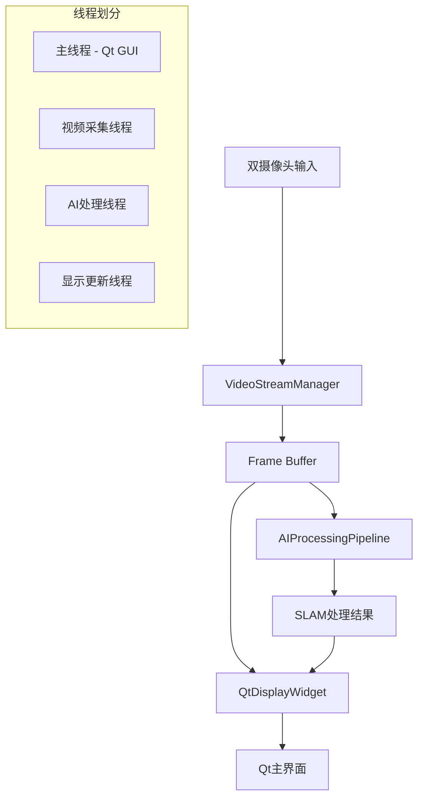

# Qt+OpenCV+AI 视频处理系统设计方案

## 1. 系统架构概览

### 1.1 整体架构图



### 1.2 核心组件

- **VideoStreamManager**: 视频流管理和同步
- **AIProcessingPipeline**: AI算法集成管道
- **QtDisplayWidget**: 统一显示界面
- **ControlPanel**: 用户控制面板
- **DataBridge**: 线程间数据传输

## 2. 详细组件设计

### 2.1 VideoStreamManager (视频流管理器)

```python
class VideoStreamManager(QObject):
    """
    职责:
    - 双摄像头数据采集
    - 帧同步和时间戳管理
    - 数据预处理和格式转换
    - 帧缓存管理
    """
    
    # Qt信号定义
    frame_ready = pyqtSignal(object)  # StereoFrame对象
    error_occurred = pyqtSignal(str)
    stats_updated = pyqtSignal(dict)
    
    def __init__(self, left_device=0, right_device=1):
        super().__init__()
        
        # 摄像头初始化
        self.left_cap = None
        self.right_cap = None
        self.device_ids = (left_device, right_device)
        
        # 缓存管理
        self.frame_buffer = Queue(maxsize=30)
        self.sync_tolerance = 0.033  # 33ms同步容差
        
        # 控制变量
        self.running = False
        self.fps_target = 30
        self.frame_counter = 0
        
        # 统计信息
        self.stats = {
            'fps': 0,
            'dropped_frames': 0,
            'sync_errors': 0
        }
    
    def initialize_cameras(self):
        """初始化双摄像头"""
        try:
            self.left_cap = cv2.VideoCapture(self.device_ids[0])
            self.right_cap = cv2.VideoCapture(self.device_ids[1])
            
            # 设置摄像头参数
            for cap in [self.left_cap, self.right_cap]:
                cap.set(cv2.CAP_PROP_FRAME_WIDTH, 1280)
                cap.set(cv2.CAP_PROP_FRAME_HEIGHT, 720)
                cap.set(cv2.CAP_PROP_FPS, self.fps_target)
                cap.set(cv2.CAP_PROP_BUFFERSIZE, 1)
            
            return True
        except Exception as e:
            self.error_occurred.emit(f"摄像头初始化失败: {e}")
            return False
    
    @pyqtSlot()
    def start_capture(self):
        """开始视频采集"""
        if not self.initialize_cameras():
            return
            
        self.running = True
        self.capture_thread = threading.Thread(target=self._capture_loop)
        self.capture_thread.daemon = True
        self.capture_thread.start()
    
    def _capture_loop(self):
        """视频采集主循环"""
        last_time = time.time()
        
        while self.running:
            try:
                # 同步读取双摄像头
                timestamp = time.time()
                ret_left, frame_left = self.left_cap.read()
                ret_right, frame_right = self.right_cap.read()
                
                if ret_left and ret_right:
                    # 创建立体帧对象
                    stereo_frame = StereoFrame(
                        frame_id=self.frame_counter,
                        timestamp=timestamp,
                        left_image=frame_left,
                        right_image=frame_right
                    )
                    
                    # 发送到缓存
                    self._enqueue_frame(stereo_frame)
                    self.frame_counter += 1
                    
                else:
                    self.stats['dropped_frames'] += 1
                
                # FPS控制
                self._control_fps(last_time)
                last_time = time.time()
                
            except Exception as e:
                self.error_occurred.emit(f"采集错误: {e}")
                break
    
    def _enqueue_frame(self, stereo_frame):
        """将帧加入缓存队列"""
        try:
            # 如果队列满，丢弃最老的帧
            if self.frame_buffer.full():
                try:
                    self.frame_buffer.get_nowait()
                    self.stats['dropped_frames'] += 1
                except:
                    pass
            
            self.frame_buffer.put(stereo_frame, block=False)
            self.frame_ready.emit(stereo_frame)
            
        except Exception as e:
            self.error_occurred.emit(f"缓存错误: {e}")
```

### 2.2 AIProcessingPipeline (AI处理管道)

```python
class AIProcessingPipeline(QObject):
    """
    职责:
    - 集成EfficientLoFTR特征匹配
    - 集成MonoGS 3D重建
    - 位姿估计和轨迹追踪
    - 处理结果缓存
    """
    
    # Qt信号定义
    processing_complete = pyqtSignal(object)  # ProcessingResult对象
    progress_updated = pyqtSignal(dict)
    error_occurred = pyqtSignal(str)
    
    def __init__(self):
        super().__init__()
        
        # AI模型初始化
        self.loftr_matcher = None
        self.mono_gs = None
        self.pnp_solver = None
        
        # 处理状态
        self.processing_queue = Queue(maxsize=10)
        self.result_cache = {}
        self.is_processing = False
        
        # 配置参数
        self.config = {
            'enable_loftr': True,
            'enable_mono_gs': True,
            'max_features': 1000,
            'confidence_threshold': 0.8
        }
    
    def initialize_models(self):
        """初始化AI模型"""
        try:
            # 初始化EfficientLoFTR
            if self.config['enable_loftr']:
                from hybrid_slam.matchers.loftr_matcher import EfficientLoFTRMatcher
                self.loftr_matcher = EfficientLoFTRMatcher()
            
            # 初始化MonoGS
            if self.config['enable_mono_gs']:
                # MonoGS初始化代码
                pass
            
            # 初始化PnP求解器
            from hybrid_slam.solvers.pnp_solver import PnPSolver
            self.pnp_solver = PnPSolver()
            
            return True
            
        except Exception as e:
            self.error_occurred.emit(f"模型初始化失败: {e}")
            return False
    
    @pyqtSlot(object)
    def process_stereo_frame(self, stereo_frame):
        """处理立体帧"""
        if self.is_processing:
            return  # 跳过如果正在处理
        
        # 添加到处理队列
        try:
            if not self.processing_queue.full():
                self.processing_queue.put(stereo_frame, block=False)
        except:
            pass  # 队列满，丢弃
    
    def _processing_loop(self):
        """AI处理主循环"""
        while self.running:
            try:
                # 从队列获取帧
                stereo_frame = self.processing_queue.get(timeout=1.0)
                
                self.is_processing = True
                start_time = time.time()
                
                # 执行处理管道
                result = self._execute_pipeline(stereo_frame)
                
                processing_time = time.time() - start_time
                result.processing_time = processing_time
                
                # 发送结果
                self.processing_complete.emit(result)
                self.is_processing = False
                
            except Empty:
                continue
            except Exception as e:
                self.error_occurred.emit(f"处理错误: {e}")
                self.is_processing = False
    
    def _execute_pipeline(self, stereo_frame):
        """执行完整的AI处理管道"""
        result = ProcessingResult(stereo_frame.frame_id)
        
        try:
            # 步骤1: 特征匹配
            if self.loftr_matcher:
                matches, confidence = self.loftr_matcher.match_pair(
                    stereo_frame.left_image, 
                    stereo_frame.right_image
                )
                result.matches = matches
                result.confidence = confidence
            
            # 步骤2: 位姿估计
            if self.pnp_solver and result.matches:
                pose = self.pnp_solver.estimate_pose(result.matches)
                result.pose = pose
            
            # 步骤3: 3D重建 (如果需要)
            if self.mono_gs:
                # MonoGS处理
                pass
            
            # 步骤4: 生成可视化数据
            result.visualization_data = self._create_visualization_data(
                stereo_frame, result
            )
            
        except Exception as e:
            result.error = str(e)
        
        return result
```

### 2.3 QtDisplayWidget (显示组件)

```python
class QtDisplayWidget(QWidget):
    """
    职责:
    - 原始视频流显示
    - AI处理结果可视化
    - 多窗口布局管理
    - 实时性能监控
    """
    
    def __init__(self):
        super().__init__()
        
        # 显示组件
        self.left_video_label = QLabel()
        self.right_video_label = QLabel()
        self.result_display_label = QLabel()
        self.info_panel = QTextEdit()
        
        # 布局设置
        self.setup_layout()
        
        # 显示状态
        self.current_stereo_frame = None
        self.current_result = None
        self.fps_counter = 0
        self.last_fps_time = time.time()
    
    def setup_layout(self):
        """设置界面布局"""
        # 主布局
        main_layout = QVBoxLayout()
        
        # 顶部：原始视频显示
        video_layout = QHBoxLayout()
        
        # 左摄像头显示
        left_group = QGroupBox("左摄像头")
        left_layout = QVBoxLayout()
        self.left_video_label.setMinimumSize(640, 480)
        self.left_video_label.setStyleSheet("border: 1px solid gray;")
        left_layout.addWidget(self.left_video_label)
        left_group.setLayout(left_layout)
        
        # 右摄像头显示
        right_group = QGroupBox("右摄像头")
        right_layout = QVBoxLayout()
        self.right_video_label.setMinimumSize(640, 480)
        self.right_video_label.setStyleSheet("border: 1px solid gray;")
        right_layout.addWidget(self.right_video_label)
        right_group.setLayout(right_layout)
        
        video_layout.addWidget(left_group)
        video_layout.addWidget(right_group)
        
        # 底部：处理结果显示
        result_layout = QHBoxLayout()
        
        # AI处理结果可视化
        result_group = QGroupBox("AI处理结果")
        result_inner_layout = QVBoxLayout()
        self.result_display_label.setMinimumSize(800, 400)
        self.result_display_label.setStyleSheet("border: 1px solid gray;")
        result_inner_layout.addWidget(self.result_display_label)
        result_group.setLayout(result_inner_layout)
        
        # 信息面板
        info_group = QGroupBox("系统信息")
        info_layout = QVBoxLayout()
        self.info_panel.setMaximumWidth(300)
        self.info_panel.setReadOnly(True)
        info_layout.addWidget(self.info_panel)
        info_group.setLayout(info_layout)
        
        result_layout.addWidget(result_group)
        result_layout.addWidget(info_group)
        
        # 添加到主布局
        main_layout.addLayout(video_layout)
        main_layout.addLayout(result_layout)
        
        self.setLayout(main_layout)
    
    @pyqtSlot(object)
    def update_video_display(self, stereo_frame):
        """更新视频显示"""
        self.current_stereo_frame = stereo_frame
        
        # 转换并显示左摄像头
        left_pixmap = self._cv2_to_qpixmap(stereo_frame.left_image)
        self.left_video_label.setPixmap(left_pixmap.scaled(
            self.left_video_label.size(), Qt.KeepAspectRatio
        ))
        
        # 转换并显示右摄像头
        right_pixmap = self._cv2_to_qpixmap(stereo_frame.right_image)
        self.right_video_label.setPixmap(right_pixmap.scaled(
            self.right_video_label.size(), Qt.KeepAspectRatio
        ))
        
        # 更新FPS显示
        self._update_fps_display()
    
    @pyqtSlot(object)
    def update_result_display(self, processing_result):
        """更新AI处理结果显示"""
        self.current_result = processing_result
        
        if processing_result.visualization_data:
            # 显示处理结果可视化
            vis_pixmap = self._cv2_to_qpixmap(
                processing_result.visualization_data
            )
            self.result_display_label.setPixmap(vis_pixmap.scaled(
                self.result_display_label.size(), Qt.KeepAspectRatio
            ))
        
        # 更新信息面板
        self._update_info_panel(processing_result)
    
    def _cv2_to_qpixmap(self, cv_image):
        """OpenCV图像转Qt Pixmap"""
        height, width, channel = cv_image.shape
        bytes_per_line = 3 * width
        q_image = QImage(cv_image.data, width, height, 
                        bytes_per_line, QImage.Format_RGB888).rgbSwapped()
        return QPixmap.fromImage(q_image)
    
    def _update_info_panel(self, processing_result):
        """更新信息显示面板"""
        info_text = f"""
系统状态信息:
━━━━━━━━━━━━━━━━
帧ID: {processing_result.frame_id}
处理时间: {processing_result.processing_time:.1f}ms
匹配置信度: {processing_result.confidence:.3f}
特征匹配数: {len(processing_result.matches) if processing_result.matches else 0}
当前FPS: {self.fps_counter:.1f}

位姿信息:
X: {processing_result.pose[0]:.3f} if processing_result.pose else 'N/A'}
Y: {processing_result.pose[1]:.3f} if processing_result.pose else 'N/A'}
Z: {processing_result.pose[2]:.3f} if processing_result.pose else 'N/A'}

错误信息:
{processing_result.error if processing_result.error else '正常'}
        """
        
        self.info_panel.setText(info_text)
```

### 2.4 MainWindow (主窗口)

```python
class MainWindow(QMainWindow):
    """
    主应用程序窗口
    职责:
    - 整合所有组件
    - 菜单和工具栏
    - 系统控制逻辑
    - 配置管理
    """
    
    def __init__(self):
        super().__init__()
        
        # 核心组件初始化
        self.video_manager = VideoStreamManager()
        self.ai_pipeline = AIProcessingPipeline()
        self.display_widget = QtDisplayWidget()
        
        # 界面初始化
        self.init_ui()
        self.setup_connections()
        self.setup_menus()
        
        # 状态变量
        self.is_running = False
    
    def init_ui(self):
        """初始化用户界面"""
        self.setWindowTitle("Hybrid SLAM - Qt+OpenCV+AI视频处理系统")
        self.setGeometry(100, 100, 1600, 1200)
        
        # 设置中央widget
        self.setCentralWidget(self.display_widget)
        
        # 状态栏
        self.status_bar = self.statusBar()
        self.status_bar.showMessage("就绪")
    
    def setup_connections(self):
        """建立信号连接"""
        # 视频流 -> 显示
        self.video_manager.frame_ready.connect(
            self.display_widget.update_video_display
        )
        
        # 视频流 -> AI处理
        self.video_manager.frame_ready.connect(
            self.ai_pipeline.process_stereo_frame
        )
        
        # AI处理结果 -> 显示
        self.ai_pipeline.processing_complete.connect(
            self.display_widget.update_result_display
        )
        
        # 错误处理
        self.video_manager.error_occurred.connect(self.handle_error)
        self.ai_pipeline.error_occurred.connect(self.handle_error)
    
    def setup_menus(self):
        """设置菜单栏"""
        menubar = self.menuBar()
        
        # 文件菜单
        file_menu = menubar.addMenu('文件')
        file_menu.addAction('保存配置', self.save_config)
        file_menu.addAction('加载配置', self.load_config)
        file_menu.addSeparator()
        file_menu.addAction('退出', self.close)
        
        # 控制菜单
        control_menu = menubar.addMenu('控制')
        self.start_action = control_menu.addAction('开始', self.start_system)
        self.stop_action = control_menu.addAction('停止', self.stop_system)
        self.stop_action.setEnabled(False)
        
        # 设置菜单
        settings_menu = menubar.addMenu('设置')
        settings_menu.addAction('摄像头配置', self.configure_cameras)
        settings_menu.addAction('AI模型配置', self.configure_ai_models)
    
    @pyqtSlot()
    def start_system(self):
        """启动系统"""
        try:
            # 初始化AI模型
            if not self.ai_pipeline.initialize_models():
                return
            
            # 启动视频采集
            self.video_manager.start_capture()
            
            # 启动AI处理
            self.ai_pipeline.start_processing()
            
            self.is_running = True
            self.start_action.setEnabled(False)
            self.stop_action.setEnabled(True)
            self.status_bar.showMessage("系统运行中...")
            
        except Exception as e:
            self.handle_error(f"系统启动失败: {e}")
    
    @pyqtSlot()
    def stop_system(self):
        """停止系统"""
        try:
            self.video_manager.stop_capture()
            self.ai_pipeline.stop_processing()
            
            self.is_running = False
            self.start_action.setEnabled(True)
            self.stop_action.setEnabled(False)
            self.status_bar.showMessage("系统已停止")
            
        except Exception as e:
            self.handle_error(f"系统停止失败: {e}")
    
    @pyqtSlot(str)
    def handle_error(self, error_msg):
        """错误处理"""
        QMessageBox.warning(self, "错误", error_msg)
        self.status_bar.showMessage(f"错误: {error_msg}")
```

## 3. 数据结构定义

```python
@dataclass
class StereoFrame:
    """立体帧数据结构"""
    frame_id: int
    timestamp: float
    left_image: np.ndarray
    right_image: np.ndarray
    metadata: Dict[str, Any] = field(default_factory=dict)

@dataclass  
class ProcessingResult:
    """AI处理结果数据结构"""
    frame_id: int
    matches: List[Tuple[np.ndarray, np.ndarray]] = None
    confidence: float = 0.0
    pose: np.ndarray = None
    processing_time: float = 0.0
    visualization_data: np.ndarray = None
    error: str = None
    metadata: Dict[str, Any] = field(default_factory=dict)
```

## 4. 线程架构

### 4.1 线程分工
- **主线程**: Qt GUI更新和用户交互
- **视频采集线程**: 双摄像头数据采集和同步
- **AI处理线程**: 深度学习模型推理
- **显示更新线程**: 界面刷新和可视化

### 4.2 线程通信
- 使用Qt的信号槽机制进行线程间通信
- 使用Queue进行数据缓存和流控
- 避免直接共享数据，确保线程安全

## 5. 性能优化策略

### 5.1 内存管理
- 图像数据使用共享内存
- 结果缓存LRU策略
- 及时释放不需要的帧

### 5.2 计算优化
- GPU加速AI模型推理
- 异步处理管道
- 自适应帧率控制

### 5.3 显示优化  
- 图像缩放缓存
- 增量更新策略
- 硬件加速渲染

## 6. 扩展性设计

### 6.1 模块化架构
- 插件式AI模型加载
- 可配置的处理管道
- 标准化的接口定义

### 6.2 配置管理
- YAML配置文件
- 运行时参数调整
- 配置热重载

这个设计方案提供了一个清晰、模块化的架构，能够有效整合OpenCV视频处理、Qt界面显示和AI模型处理，同时保证良好的性能和扩展性。